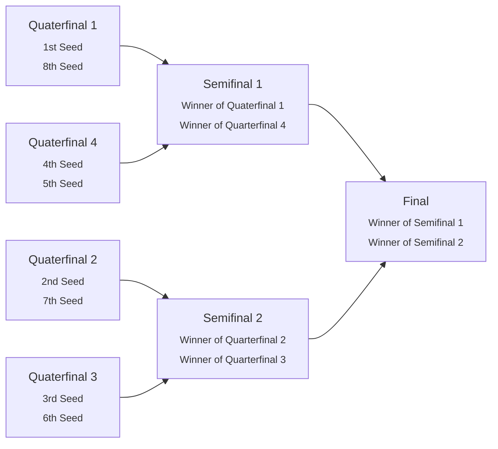
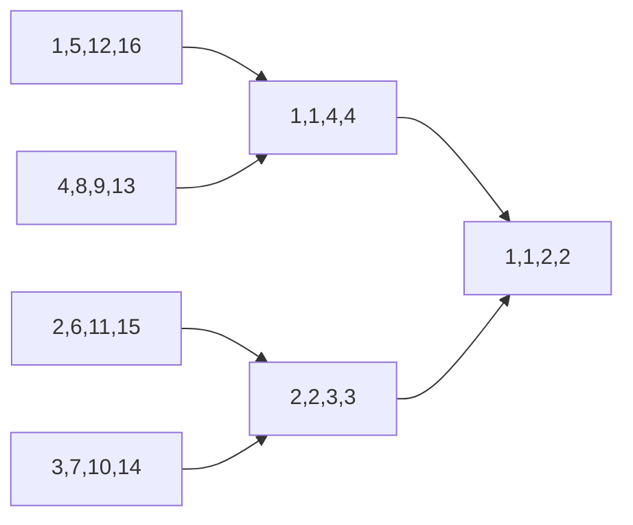
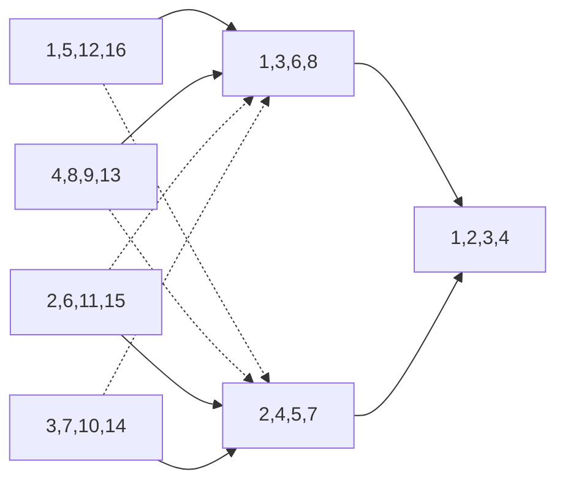
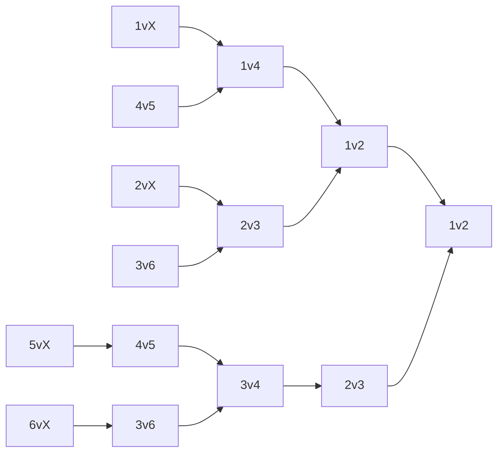
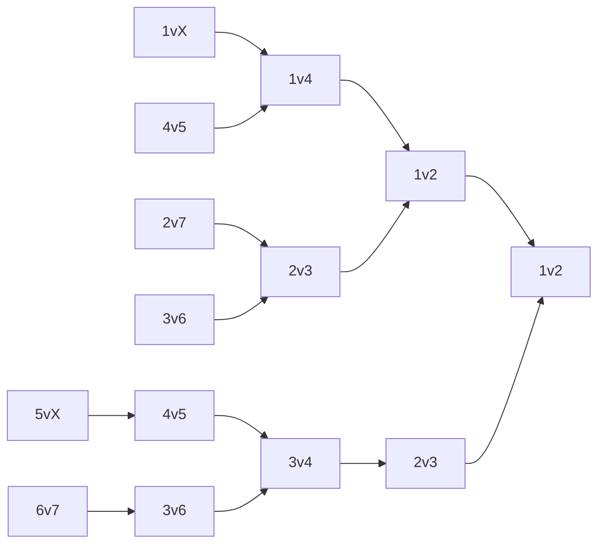

# Creating a Single Elimination Bracket
## Single Round Ideal Seeding
This covers the case of seeding a single round of participants, where the number of participants is evenly divisible by the participants in a match. This does not cover seeding of subsequent rounds.
### Case 1: 2 to 1 
In the case of 1v1 single winner matches (2 participants to 1 winner), seeding is trivial. Suppose we have participants {1,2,3,4} whose seed is the same as their number. We would have 2 matches, match A and match B.

We would map the first and last seed to the same match
```
1 -> A
2
3
4 -> A
```

Then map the second and second last seed to the same match
```
1
2 -> B
3 -> B
4
```

Resulting in the final assignments:
```
Match A: 1,4
Match B: 2,3
```

This process can be extended for any 2*n participant brackets.

The following pseudocode describes an algorithmic way to make these assignments:
<details>
  <summary>Code Breakdown</summary>

  This code is written as pseudocode, meaning it isn't in any particular language. The intent is clarity and broad readability.

  The code assumes that allParticipants is sorted according to seed (increasing). This means the top seed is at index 0 in allParticipants.

  Participant and Match are both assumed to be classes, their implementation is omitted because it's not the focus here. Similarly the details of the Assign function aren't included, as they aren't critical to understand whats going on. Minimal requirements for each class are listed below:
  - Participant must have some identifying information for the participant, and optionally their seed.
  - Match must contain a list of Participants, and later on will require the ability to point to other matches. It must implement the Assign method, which takes a Participant as an argument, and adds the participant to its own list of Participants for this particular match.

  % is the modulo operator, `a % b` returns the remainder of `a / b`.

  The comment indicating the constraint could be written as an assertion were this actually implemented, but later on we will remove this constraint.

  The line `Match[numMatches] allMatches` is meant to represent the allocation/initialization of a list of numMatches length, in most languages this would be more involved, but for our purposes all we need to know is that the list exists, and how long it is.
</details>

```c++
AssignIdealSingleRoundMatches(Participant[] allParticipants, int numParticipants):
  // Constraint: numParticipants % 2 == 0
  numMatches = numParticipants / 2

  Match[numMatches] allMatches
  for i = 0 to numMatches:
    allMatches[i].assign(allParticipants[i])
    allMatches[i].assign(allParticipants[numParticipants - i - 1])

  return allMatches
```

#### Case 2: n to 1 
Lets now suppose each match has n participants. This introduces a number of new ways to decide the seeding of a new match. We'll take the case of 3 to 1, and look at participants {1,2,3,4,5,6}. Seed 1 and 2 should be in different matches, and seed 1 should have the "easier match of the two".


Depending on how strongly we wish to favour the top seed, the following could work in one of a few ways. The way that provides the most "fair" match-ups can be conceptualized by splitting all the participants into n "buckets", where n is the number of participants in a match.

For the 1-6 example this would look like:
```
1,2
---
3,4
---
5,6
```
1-12 example: `1,2,3,4 | 5,6,7,8 | 9,10,11,12`

Then, assign to matches in increasing order for the first bucket, and decreasing order for every other bucket. For the 1-6 example this produces the following:

```
1 -> A
2 -> B
---
3 -> B
4 -> A
---
5 -> B
6 -> A
```

This gives the final assignment of:
```
Match A: 1v4v6
Match B: 2v3v5
```
Or in the 1-12 example:
```
Match A: 1,8,12
Match B: 2,7,11
Match C: 3,6,10
Match D: 4,5,9
```

The following pseudocode describes an algorithmic way to make these assignments:
```c++
AssignIdealSingleRoundMatches(Participant[] allParticipants, int numParticipants, int participantsPerMatch):
  // Constraint: numParticipants % participantsPerMatch == 0

  numMatches = numParticipants / participantsPerMatch
  Match[numMatches] allMatches
  for i = 0 to numMatches:
    for j = 0 to participantsPerMatch:
      if j == 0:
        allMatches[i].assign(allParticipants[i])
      else:
        allMatches[nm - 1 - i].assign(allParticipants[i + j * nm])
  
  return allMatches
``` 
### Case 3: n to m
This is very similar to Case 2, but we take from the first m buckets in increasing order.

To illustrate this we will look at an example of 5 to 2, with participants {1,2,3,4,5,6,7,8,9,10}. Following our previous example we will first split into n (5) buckets:
```
1
2
---
3
4
---
5
6
---
7
8
---
9
10
```


Then for the first m (2) buckets we assign in increasing order, and for the remaining buckets assign in decreasing order. We will again have matches A and B.
```
Increasing order:
1 -> A
2 -> B
---
Increasing order:
3 -> A
4 -> B
---
Decreasing order:
5 -> B
6 -> A
---
Decreasing order:
7 -> B
8 -> A
---
Decreasing order:
9 -> B
10 -> A
```

Which results in the final assignments of:
```
Match A: 1,3,6,8,10
Match B: 2,4,5,7,9
```


A slight update to the previous algorithm can make these new assignments:
```c++
AssignIdealSingleRoundMatches(Participant[] allParticipants, int numParticipants, int participantsPerMatch, int winnersPerMatch):
  // Constraint: numParticipants % participantsPerMatch == 0

  numMatches = numParticipants / participantsPerMatch
  Match[numMatches] allMatches
  for i = 0 to numMatches:
    for j = 0 to participantsPerMatch:
      if j < winnersPerMatch:
        allMatches[i].assign(allParticipants[i + j * nm])
      else:
        allMatches[nm - 1 - i].assign(allParticipants[i + j * nm])
  
  return allMatches
```
## Single Round Non-Ideal Seeding
This covers the case of seeding a single round of matches with n participants and m winners, for any arbitrary number of participants.

Most of the procedures for single round non-ideal seeding match those for the ideal case. For our previous methods to apply, we need a number of participants that is divisible by the number of participants per match (denoted as n).

To accommodate this, some matches will be missing one or more participants. In the case of a bracket with 2 participants per match this is commonly referred to as a BYE round. Going forward BYE will refer to a dummy participant which doesn't actually participate, but is a placeholder for within the bracket.

Lets look at a 2 participant per match example to begin. Suppose we have participants {1,2,3,4,5}. For our methods to work we will need the number of participants to be divisible by 2, which 5 is not. This constraint can be formalized as:

```number of participants % participants per match == 0```

Where % is the modulo operator.

To satisfy this constraint we must add additional placeholders (BYEs) until this constraint is satisfied. In this case we'd add one. To find how many placeholders to add for any given bracket we can use the following formula:

```participants per match - (number of participants % participants per match)```

Once we have added our placeholders, the process is exactly the same as before.

We can update our algorithm from before to implement this update:
```c++
AssignSingleRoundMatches(Participant[] allParticipants, int numParticipants, int participantsPerMatch, int winnersPerMatch):
  if numParticipants % participantsPerMatch != 0:
    int numPlaceholders = participantsPerMatch - (numParticipants % participantsPerMatch)
    allParticipants = allParticipants.addPlaceholderParticipants(numPlaceholders)

  numMatches = numParticipants / participantsPerMatch
  Match[numMatches] allMatches
  for i = 0 to numMatches:
    for j = 0 to participantsPerMatch:
      if j < winnersPerMatch:
        allMatches[i].assign(allParticipants[i + j * nm])
      else:
        allMatches[nm - 1 - i].assign(allParticipants[i + j * nm])
```
## Seeding Subsequent Rounds
### Case 1: Participants Per Match is Divisible by Winners Per Match
*For brevity participants per patch and winners per match will hitherto be referred to as PPM and WPM respectively.*

#### Case 1.1: Single Winner Per Match
When each match only has a single winner, the winner of the match should be given the top seed present in the match when going into the next round. Meaning if 1 and 8 are paired together, the winner would always be seeded as 1 going into the next round. This can extend to >2 PPM; if a match was 2v7v11, the winner would be given the 2 seed in the next round.
<details>
  <summary>What happens if participants keep their seed?</summary>
  This is a valid way to run a bracket, however, it means that its impossible to pre-generate all the matches & connections between them. This is because which participants are in which match depends on which seeds are present in the round, which depends on the results of the previous round.
  
  Take the bracket below as an example. Assume the winners from the first round are 1,2,3,4. This means the next round would have 1v4, and 2v3.

  However, if we assume the winners are 8,2,3,4 the next round would be 2v8, 3v4. This means that depends on who wins, 2 and 3 either go to different matches, or the same match, which means no definite bracket can be drawn ahead of time.

  This solution would also only make sense in the case where seeding is strongly defined, as it will provide even greater advantage to participants with a better seed, which may be undesirable if seeding is poorly defined or perhaps even random.
</details>
<br>
In the diagram below the rounds are given their conventional names for readability, as well as being numbered according to the top seed present in the match (i.e. the top seed in Semifinal 2, is seed 2).



Notice how if we look at the semifinal round, it exactly resembles the structure of a 2 PPM, 1 WPM bracket with only 4 participants. The matches are 1v4 and 2v3, same as they would be were it instead the first round.

This points to a recursive approach. This approach could be described as seeding a single round, getting the seeds of all the winners (which we set as the highest seed present in the match), then seeding a round using the winners' seeds. This can be repeated until there is only a single match in a round, at which point the winner of that match is the winner of the bracket.

#### Case 1.2: Multiple Winners Per Match
*Note that this case still only covers when `PPM % WPM == 0`*.

Multiple winners presents a unique issue depending on how seeding is handled. There are two valid options, which will be showcased in the context of 4 PPM, 2 WPM matches.
1. All winners inherit the top seed of the match. As an example, if round 1 had 1v5v12v16, both winners would be assigned 1 seed for round 2.
1. Winners inherit their seed according to placement. Using the same example of 1v5v12v16, going into the next round 1st place would get 1 seed, and 2nd place would get 5 seed.

Neither of these is a perfect solution.

Solution 1 preserves an easy to visualize bracket, where all winners from a single match move on to the same subsequent match, allowing the connections between matches to be easily drawn. See a simplified bracket diagram below, where only the seeds of each participant is shown within each match:

Unfortunately this leads to seeding mostly breaking down after the first round, and it gets worse with larger brackets.

Solution 2 preserves the integrity of seeding in rounds beyond the first, however, it results in winners from a single match being in different matches in subsequent rounds, thus making it difficult to visualize the connections. An example of this solution is shown below, in the same style as the solution 1 bracket:

Another flaw in this approach is that it requires that each match not only output winners, but that it output winners in order from "most winner" to "least winner". If that information is not available, it would be possible to use the seeding to determine which winners should be awarded a higher seed in subsequent rounds.

It bears mention that winners from a single match not being placed together in subsequent matches could be viewed as a positive depending on the application.

Either of these solutions is valid, however when looking at [Case 2](#case-2-participants-per-match-not-divisible-by-winners-per-match), solution 2 is preferred, as in that case it is impossible to have all winners from a match end up in the same match in the next round.

<details>
  <summary>What about having a single winner?</summary>
  In Case 1.1 this was trivial, as the final match of the bracket would produce a single winner, which could then be considered the winner of the entire bracket. In this case there are a few options, the best one will depend on context.

  - Run the final match and take the multiple winners as the winners of the bracket
  - Run the final match and take whichever winner comes 1st in the final match as the winner of the bracket
  - Have the final match only produce a single winner
  - Create another match after the "final" match that takes all the winners from the "final" match and only produces a single error.
</details>

### Case 2: Participants Per Match NOT Divisible by Winners Per Match

If `PPM % WPM != 0` then it is impossible to have all winners from a single match go to the same match in subsequent rounds. Take the example of 5 PPM, 3 WPM. Every round 1 match will contribute 3 participants to round 2. This means that to create one match in round 2, you will need 1 and 2/3rds round 1 matches. This implies that even disregarding all seeding, it is not possible to keep winners from 1st round matches in the same matches for round 2.

Given that this is the case, it makes the most sense to make use of solution 2 proposed in Case 1.2.

### Additional Constraint

Our previous constraint was to ensure we have the right quantity participants to fill a single round, and it stated that `Number of Participants % PPM == 0`. However, when seeding multiple rounds, we must additionally ensure that each subsequent round will have a valid number of participants. Given one round has `X` matches, the next round will have `X * WPM` matches.

We will begin with the `PPM % WPM == 0` case. Knowing that our final round will have `1 * PPM` participants (as there is only one match, the finals), we can work backwards. The round before last will need to produce `1 * PPM` winners, meaning we know `X * WPM = PPM`. Solving for `X` gives us `X = PPM / WPM`. Extending this logic tells us that each round will have a number of matches equal to `PPM / WPM` multiplied by the number of matches in the subsequent round. This is an exponential relationship where our base is `PPM / WPM`.

This means our final match will have PPM participants, and each previous round will increase the number of participants by a factor of PPM/WPM. So to ensure that the number of participants is valid, it must be the case that starting with the total number of participants, and multiplying by WPM/PPM repeatedly should eventually yield the number of participants in the final: PPM. This can be stated more formally as: 

$\log_{\mathrm{PPM/WPM}}{(\frac{Num Participants}{PPM})} \: \% \: 1 \: == 0$

*Note that specifying `some quantity % 1 == 0` is the same as specifying that it is a whole number.*

For a given number of participants `P`, and a PPM to WPM ratio of `PPM / WPM = B` the number of placeholders to be added can be given as:

$B^{\left(\log_{B}\left(P\right)+1-\operatorname{mod}\left(\log_{B}\left(P\right),1\right)\right)}-P$

TODO: express that the issue is that there is no value of numparticipants that can satisfy the eqation: $\log_{\mathrm{PPM/WPM}}{(\frac{Num Participants}{PPM})} \: \% \: 1 \: == 0$

Unfortunately, as with before when `PPM % WPM != 0` there are additional considerations. The result is that it is impossible to only have 1st round BYEs. With the previous method, placeholder contestants (BYEs) would only appear in the first round. However, in this case, it is unavoidable to have BYEs in subsequent rounds. To illustrate this we will take a 3 PPM, 2 WPM bracket with 15 total participants.

```
1st Round: 15 Participants => 5 Matches => 10 Winners
2nd Round: 10 Participants => 3 & 1/3 Matches => INVALID
```

This is just an example, but it should provide some intuition on the inherent issue at hand, a more rigorous explanation is viewable in [Appendix 1](#appendix-1-why-a-3-to-2-bracket-always-requires-non-1st-round-byes).

No perfect solution is available, but the best solution is to add placeholder participants as required in each round. This means following the procedure described in the [Single Round Non-Ideal Seeding](#single-round-non-ideal-seeding) section before seeding each round.

### Pseudocode
TODO: Multiple rounds pseudocode

# Double Elimination
In a single elimination bracket, losing a single match causes a participant to be eliminated fromt the bracket, hence the name. A double elimination bracket gives each participant a second chance, meaning two losses are required to be eliminated*.

<details>
  <summary>*Two losses aren't always required</summary>
  
  TODO: Write about bracket reset here
</details>
<br>

In effect this creates two intertwined brackets, commonly referred to as "winner's bracket" and "loser's bracket". Participants in the winners bracket have yet to lose a single match, whereas those in losers have already lost one. Losing a match in winner's bracket will send a participant to loser's bracket, and losing a match in loser's bracket will eliminate the participant. For now we will assume all participants begin in the winner's bracket.


### Case 1: 2 to 1 Ideal
We will first examine the double elimination bracket in the context of a familiar 2 PPM, 1 WPM bracket. Ideal in this case refers to satisfying the constraint: $\:\log_2{(Num Participants)}\:\%\:1==\:0$. For a sufficiently sized example we will use 8 participants. Here are the first round winner's bracket matchups:

```
1st Round Winner's:
1v8
2v7
3v6
4v5
```

For now we will assume the higher seed wins in each matchup. This means 1,2,3,4 all win a match, and 5,6,7,8 all lose a match. Using the same single round seeding algorithm as before will yield the following 2nd round winner's and 1st round loser's matches:

```
2nd Round Winner's:
1v4
2v3

1st Round Loser's:
5v8
6v7
```

Following our same higher-seed-wins assumption means that after these matches resolve: `1,2` have not lost a match, whereas `3,4,5,6` have all lost a single match, and `7,8` are eliminated. Generating the next round of matches gives:

```
3rd Round Winner's:
1v2

2nd Round Loser's:
3v6
4v5
```

After this `1` has not lost a match, `2,3,4` have lost one, `5,6,7,8` are eliminated. Here we run into a problem, we have an odd number of participants, both in the winner's and loser's bracket. So we'll add an extra match between `3` and `4` in the lower bracket before continuing. After that extra match, only `1,2,3` will remain. `2,3` in loser's bracket, `1` in winner's bracket.

The final two required matches are between `2,3` in loser's bracket, and the winner of that match against `1` in grand finals.

Lets see that in a diagram for some clarity:


This provides some valuable insights:
1. The winner's bracket looks identical to a single elimination bracket, up until the grand finals.
2. The loser's bracket requires more rounds than the winner's bracket.
3. The number of matches in the loser's bracket follows a unique pattern.

Let's begin with insight #1. This is helpful knowledge as it lets us effectively eliminate half the problem. We already have the knowledge to create a single elimination bracket, and therefore we know how to create the winner's bracket. Now we can focus in on the loser's bracket.

Insight #2 tells us that there is something different about the loser's bracket, and that unique aspect is the "extra" match we had to add: `3v4`. Remember that we added this because we had an odd number of participants in loser's bracket, meaning not all participants could be placed into a match. The match was between `3` and `4` because those were the two already in loser's bracket, so it makes more sense that they be placed in a match together, which determines which one will continue on to face `2`.

Lets analyze how many participants are present in each round of the loser's bracket to address why this happens. If we begin a bracket with `P` participants in winner's bracket, the first round of loser's bracket will have `P/2` participants, all of which come from winner's. Round two of loser's will still have `P/2` participants: `P/4` from round 1 of loser's, and `P/4` from round 2 of winner's. Let's follow this pattern:

| Loser's Bracket Round Num | From Previous Round  | From Winner's Bracket | Total Participants |
| ------------------------- | -------------------- | --------------------- | ------------------ |
| 1 | N/A | P/2 | P/2 |
| 2 | P/4 | P/4 | P/2 |
| 3 | P/4 | P/8 | 3P/8 |

And here is our issue: doesn't make sense to conduct a round with `3P/8` participants, as it will create inequality in the matches, where some are between two loser's bracket teams, and some are between a loser's bracket team, and a team that just lost in winner's bracket. Its also possible to end up with an odd number of participants when you have `3P/8`, which exaggerates the issue.

So this reveals an important constraint: every round in the loser's bracket should have the same number of participants from the previous round of loser's bracket, as it does from winners bracket (first round excepted).

But this is impossible, right now we have no wiggle room, and always end up with that `3P/8` problem.

So lets amend that: every round in losers round should either have the same number of participants from the previous round of loser's bracket **OR** it should only have participants from the previous round of loser's bracket (first round excepted).

This gives us something to work with. An "extra" match as we called it before, where no new participants coming from winner's are introduced, only those from the previous round of loser's. We will redo our table, and label these "extra" rounds as `x.5`. So if we have an extra round after round `2`, it will be labelled `2.5`.

| Loser's Bracket Round Num | From Previous Round  | From Winner's Bracket | Total Participants |
| ------------------------- | -------------------- | --------------------- | ------------------ |
| 1   | -   | P/2 | P/2 |
| 2   | P/4 | P/4 | P/2 |
| 2.5 | P/4 | -   | P/4 |
| 3   | P/8 | P/8 | P/4 |
| 3.5 | P/8 | -   | P/8 |
| 4   | P/16| P/16| P/8 |

*And so on and soforth*

Hopefully, this makes the trend clear. Looking at the last column we see that every two rounds, the number of participants halves. This is in contrast to the trend in winner's bracket where the number of participants halves every round. This discrepancy is because loser's bracket is constantly being fed additional participants by those losing in winner's bracket. Interestingly, this "halve every two rounds" trend holds even for the first two rounds, which have hitherto been a little bit of an exception.

One more small detail is that in all these matches, the winner will always get the higher seed going forward, and the loser will get the lower seed. As an example if `1` goes up against `8`, and `8` wins, it gets the top seed going forward, whereas `1` will get the 8th seed.

This gives us all the information we need to create an ideal 2 to 1 bracket.

### Case 2: 2 to 1 Non-Ideal
Here we run into a conceptual issue. To deal with non-ideal numbers of participants, we have hitherto added placeholders (denoted as BYEs) to accommodate have non-ideal numbers of participants. This worked well because any placeholder would automatically lose any match in which it is present, at which point it would exit the bracket and we would no longer need to consider it. Now it is instead sent to the lower bracket.

Lets take a look at that same bracket from earlier, but with only 6 participants:

*A `X` is used to represent a BYE.*



In this version of the bracket the most notable difference is that the first round of matches in the lower bracket is completely unnecessary. This isn't a perfect outcome, as it would be preferred that those losing earlier in the winner's bracket have more matches in the loser's bracket, but this is an acceptable compromise.

However, if we look again at the same setup, but with only 7 participants, there is a larger issue:



This contains a much more important issue. In the loser's bracket 1st round: `5` has a BYE, whereas `6,7` do not. Intuitively this may seem off in some way, unfortunately there is no solution which solves this more than it creates other issues. By the logic of how we've been handling non-ideal numbers of participants thus far, this inequality of matches is ostensibly acceptable, but suboptimal.

### Case 3: N to M
As is the trend, the existence of a loser's bracket can complicate what we've already covered. The key complexity of N to 1 is that the number of participants introduced into the loser's bracket by each round of the winner's bracket is equal to `PPM-WPM`. This means that for things to behave nicely, we not only need `PPM % WPM == 0`, but also `PPM % (PPM-WPM) == 0`. !!!!!!!!!!!!!!!!!!!!!!!!!!<<<<<<<<<< This is wrong

To understand what this means, and why its the case, we'll look at a 3 PPM, 1 WPM bracket. If we did this with any appreciable number of participants, the diagram would be too large to parse, so we'll make it a table. Keep in mind that for every match, 2 participants are losers, and only 1 is a winner.

| Loser's Bracket Round Num | From Previous Round  | From Winner's Bracket | Total Participants |
| ------------------------- | -------------------- | --------------------- | ------------------ |
| 1   | -     | 2P/3  | 2P/3  |
| 2   | 2P/9  | 2P/9  | 4P/9  |

Here we observe the first issue, in the 2 to 1 case the implicit target was to have an equal number of participants from the previous loser's bracket round as from the winner's bracket. However, because this isn't directly possible, the requirement was revised to a combination of two requirements:
1. A participant's first match after being sent to loser's bracket, should be against a participant from the previous round of loser's bracket.
1. For each round of loser's bracket, every match in that round should have the same number of participants from previous loser's bracket rounds

In simpler terms this means every round in loser's bracket either has no new participants from winner's bracket, or is 50% new participants from winner's bracket.

This requirement needs reevaluating for the 3 to 1 case. The intuitive expansion of our previous rules is to have 

# TODO:
- Rationalize why m to n case is the way it is
- Intro explaining what seeding is, and how everything is about tradeoffs in how important it should be
- Clarify what increasing and decreasing order means
- Add a glossary
- A 3 to 2 bracket with 9 participants never terminates (eventually you get an endless loop of two matches producing 4 winners which produces 4 matches, etc etc)

# Appendicies
## Appendix 1: Why a 3 to 2 Bracket Always Requires Non 1st Round BYEs
Assuming a bracket of `P` participants with 3 PPM (Participants per Match) and 2 WPM (Winners per Match) it is impossible to create a bracket without BYEs in rounds that aren't the first round, provided `P > 3`. The reason why relates to prime factorization and the relationship between participants in one round and the next.

In a single round every 3 participants produce 2 winners (which move on to the next round). This means that each round will have `2/3 * Previous Round Participants`. This means that for each round after the first, the prime factorization of the number of participants in that round will contain a 2.

This is where the issue lies, if at any point the number of participants in a round isn't evenly divisible by 3, then it will be impossible to create matches for that round without adding a placeholder participant (BYE). A number is only divisible by 3 if its prime factorization includes a 3. Because we are introducing a 2 into the prime factorization with each subsequent round, it is inevitable that eventually the prime facotrization will include at least two 2s, and no 3s, at which point it will be required to add a placeholder.

This logic can similarily explain why this issue doesn't occur when `PPM % WPM == 0`. If `PPM % WPM == 0`, then the relationship between number of participants in one round and the next can always be expressed as `1/N * Previous Round Participants`. This means that when multiplying, we are multiplying in a 1, which does not affect the prime factorization, and thus doesn't introduce any indivisible component into the number of participants.